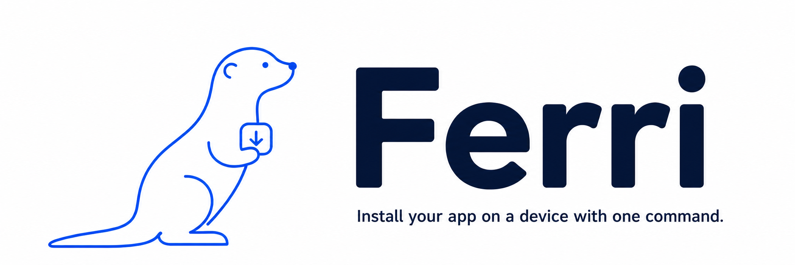

# Ferri

<p align="center"><a href="README.md">简体中文</a> · <strong>English</strong></p>

<p align="center">
  <a href="LICENSE"></a>
  
</p>



Ferri is a cross-platform app installer for mobile app testers and developers. Use the same command on macOS, Linux, or Windows to install an Android or iOS package from a file or URL on a connected device:

```sh
ferri --target ./app.apk
```

**[Install](#install) · [Quick start](#quick-start) · [Daily commands](#daily-commands) · [User guide](docs/usage-en.md)**

## Why Ferri

The name comes from **ferry**: carrying an app package to its destination device.

Get a build, connect a test device, verify the update. App testers and developers repeat this workflow every day. Ferri brings platform-specific installation commands into one familiar interface so you can focus on the app.

- **One command across platforms:** use the same `ferri` command on macOS, Linux, and Windows for APK, APKS, AAB, and IPA packages.
- **Choose the device before installing:** install directly with one device, select and confirm when several are connected, or specify an exact device ID.
- **Update existing apps:** Try updating first to preserve local data. Only after a failure and a matching installed app does Ferri offer uninstall/reinstall, with a data-loss warning. The default is no.
- **Start with less setup:** a standalone executable with no Python, Node.js, or Go runtime required. Missing device tools are installed only after confirmation.
- **Type less:** complete options, file paths, and device IDs. Misspelled options get a nearby suggestion.

## Install

> The project is preparing its first release. Remote installation below will become available after that release is published. For now, [build from source](#development-and-contributing).

### Homebrew (recommended)

```sh
brew install leo1394/ferri/ferri
```

The stable formula prefers a matching Homebrew bottle; otherwise it downloads the prebuilt executable directly. Neither path compiles locally. Both include shell completions and require no language runtime dependencies. To upgrade:

```sh
brew update
brew upgrade ferri
```

### Linux / macOS

```sh
curl -fsSL https://raw.githubusercontent.com/leo1394/homebrew-ferri/master/install.sh -o /tmp/ferri-install.sh
bash /tmp/ferri-install.sh
```

The installer verifies SHA256 and installs Ferri to `~/.local/bin`. Add that directory to PATH if prompted. Run the installer again to update.

### Windows

Run in PowerShell:

```powershell
Invoke-WebRequest https://raw.githubusercontent.com/leo1394/homebrew-ferri/master/install.ps1 -OutFile "$env:TEMP\ferri-install.ps1"
powershell -ExecutionPolicy Bypass -File "$env:TEMP\ferri-install.ps1"
```

The installer verifies SHA256, installs `ferri.exe` to `%LOCALAPPDATA%\Ferri`, and adds the directory to your user PATH. Open a new terminal to use Ferri in PowerShell or CMD.

Prebuilt packages cover Intel (amd64) and ARM64 on macOS / Linux, plus Windows x64. See the [user guide](docs/usage-en.md#installation-options) for custom directories, pinned versions, and other Unix platforms.

## Quick start

**1. Connect a device.** Enable USB debugging and authorize your computer on Android. Unlock the device and trust your computer on iOS.

**2. Install a local package.** On first use, Ferri lists any missing tools and asks before downloading them.

```sh
# Android
ferri --target ./app.apk

# iOS
ferri --target ./app.ipa
```

**3. Choose among multiple devices.** Ferri prompts you to select a device and confirm installation. If you already know its ID, specify it directly:

```sh
ferri --list
ferri --target ./app.apk --device SERIAL
```

Only devices matching the package platform are considered. `--list` uses existing device tools and never downloads them; if tools are missing, it explains which platform cannot yet be discovered.

## Install from a URL

```sh
# Direct download: detects APK, APKS, AAB and IPA archives
ferri --url "https://example.com/download/app.apk"

# Pgyer merged page: choose Android or iOS interactively
ferri --url "https://www.pgyer.com/clobotics-rea-test"

# Select a platform and device in advance
ferri --url "https://www.pgyer.com/clobotics-rea-test" --android --device SERIAL
```

| Link type | Behavior |
| --- | --- |
| Direct HTTP(S) package | Download, check the archive type, then use the local installation flow |
| Public Pgyer download / merged page | Resolve the public download entry; choose interactively or pass `--android` / `--ios` |
| Static download page / iOS OTA manifest | Extract package links or the manifest's IPA; prompt when multiple packages remain |
| Google Play app link | Open the listing on the selected Android device; complete installation on the device |
| App Store app link | Recognize the link and explain the limitation; install through App Store or provide a signed IPA |

Use either `--url` or `--target`. Quote URLs containing characters such as `&`. Downloads use built-in functionality with no additional runtime dependencies. Temporary packages are removed after success or failure. For pages requiring login, passwords, CAPTCHA or complex JavaScript, download in a browser and use `--target`. See [URL installation](docs/usage-en.md#url-installation).

## Daily commands

| Task | Command |
| --- | --- |
| Install / update an APK | `ferri --target ./app.apk` |
| Install from a URL | `ferri --url "https://example.com/app.apk"` |
| Select Android from a merged page | `ferri --url "https://www.pgyer.com/clobotics-rea-test" --android` |
| Install an IPA | `ferri --target ./app.ipa` |
| Install an APKS archive | `ferri --target ./app.apks` |
| Build and install from an AAB | `ferri --target ./app.aab` |
| List connected devices | `ferri --list` |
| Install on a specific device | `ferri --target ./app.apk --device SERIAL` |
| Use a path containing spaces | `ferri --target "./build outputs/app.apk"` |
| Show help | `ferri --help` |
| Show the version | `ferri version` or `ferri --version` |

Short options `-T`, `-d`, `-l`, `-h`, and `-v` are also supported. Non-interactive sessions with multiple devices must specify `--device`. Missing tools produce an error instead of a silent download.

Android installation automatically restarts adb once if discovery fails, returns no devices, or the target is offline.

## Tools, only when needed

Ferri checks only the tools required by the current package and reuses existing installations. If something is missing, it asks once for the missing tools. **The default is not to install:**

```text
Missing tools: java, bundletool
Install into /Users/me/.ferri (no administrator access)?
Download and install these tools? [y/N]:
```

| Package | Tools used |
| --- | --- |
| APK | adb |
| IPA | go-ios |
| AAB / APKS | adb, Java 17+, bundletool |

Approved downloads go into `~/.ferri`, without administrator access or changes to the system PATH. **Java and bundletool are required only for AAB / APKS.** Device listing, help, version output, and completion never download tools.

## Shell completion

Supports **Bash, Zsh, Fish, and PowerShell 7**:

- Options: `--target`, `--url`, `--android`, `--ios`, `--list`, `--device`, `--help`, `version`, `--version`.
- Paths: complete files and directories after `--target`, including paths with spaces.
- Devices: complete available device IDs after `--device`.

Homebrew installs completion scripts; the standalone installers include them too. Follow the [completion setup](docs/usage-en.md#completion-setup) to enable them. CMD does not support Ferri's custom option completion.

## Devices and installation notes

- **Android:** USB debugging must be authorized. Devices marked offline or unauthorized cannot receive an installation.
- **iOS:** the IPA needs a valid signature / provisioning profile for the target device. Windows may require Apple device drivers; Linux requires the usbmuxd service.
- **Confirmed reinstallation:** uninstalling deletes local app data; an uninstall failure stops the retry. If the new installation fails after uninstalling, Ferri cannot restore the old app or its data. AAB builds use bundletool’s debug key by default.
- **Platform differences:** Linux ARM64 requires an adb package from your distribution. Running the x64 binary on Windows ARM64 requires OS emulation support.

See the [user guide](docs/usage-en.md) for environment settings, exit codes, and troubleshooting.

## Development and contributing

Issues and improvements are welcome. When reporting an installation problem, include the Ferri version, host operating system, package format, and error output.

Building from source requires Go 1.23+. Users of release binaries do not need Go:

```sh
go build -o bin/ferri .
./bin/ferri --help
go test ./...
go vet ./...
```

On Windows, use `go build -o bin/ferri.exe .`. To install a local build, run `bash install.sh --local` or `./install.ps1 -Local`.

[Testing and development](docs/usage-en.md#development-checks) · [Release process (Chinese)](RELEASING.md)

## License

[MIT](LICENSE)
