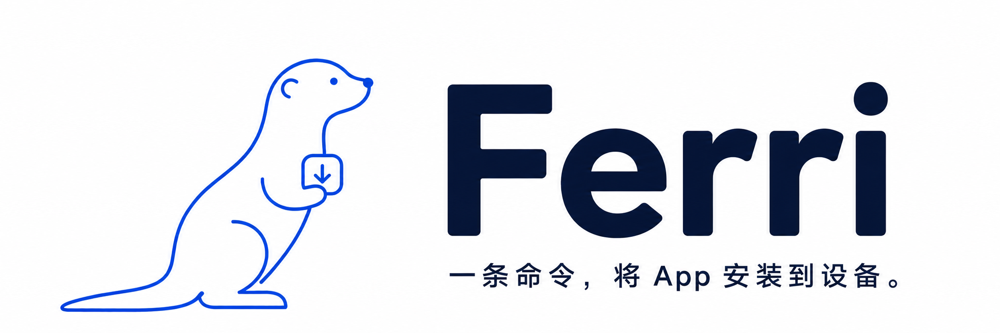

# Ferri

<p align="center"><strong>简体中文</strong> · <a href="README-EN.md">English</a></p>

<p align="center">
  <a href="LICENSE"></a>
  
</p>



Ferri 是面向 App 测试与开发的跨平台安装工具。在 macOS、Linux 或 Windows 上，用同一条命令将本地或链接中的 Android / iOS 安装包安装到连接的设备上：

```sh
ferri --target ./app.apk
```

**[安装](#安装) · [快速上手](#快速上手) · [常用命令](#常用命令) · [使用指南](docs/usage.md)**

## 为什么使用 Ferri

Ferri 的名字取自 **ferry（渡船）**：承载安装包，送达目标设备。

拿到一个安装包、连接测试设备、验证新版本——这是测试人员和开发人员每天都会重复的工作。Ferri 将不同平台的安装命令收敛到同一个入口，让你专注于应用本身。

- **一个命令，多个平台**：在 macOS、Linux、Windows 上使用相同的 `ferri` 命令，支持 APK、APKS、AAB、IPA。
- **更新已有应用**：优先覆盖安装，保留本地数据。失败且检测到同 ID 应用时，提示数据丢失风险，确认后才卸载重装；默认不卸载。
- **轻装上手**：独立可执行文件，无需预装 Python、Node.js 或 Go；缺少设备工具时，按需安装。

## 安装

### Homebrew（推荐）

```sh
brew install leo1394/ferri/ferri
```

稳定版优先安装匹配的 Homebrew Bottle；没有匹配 Bottle 时直接下载对应平台的可执行文件。两种方式都不需要本地编译，包含 Shell 补全，没有语言运行时依赖。升级时运行：

```sh
brew update
brew upgrade ferri
```

### Bash (Linux / macOS)

如果本机 Homebrew 版本过低，无法安装 Formula，可通过 Bash 构建并安装已发布
版本：

```sh
curl -fsSL https://raw.githubusercontent.com/leo1394/homebrew-ferri/master/install.sh -o /tmp/ferri-install.sh
bash /tmp/ferri-install.sh
```

安装器校验 SHA256，将 Ferri 安装到 `~/.local/bin`。如果该目录不在 PATH 中，按提示添加。再次运行安装器即可更新。

### Windows

在 PowerShell 中运行：

```powershell
Invoke-WebRequest https://raw.githubusercontent.com/leo1394/homebrew-ferri/master/install.ps1 -OutFile "$env:TEMP\ferri-install.ps1"
powershell -ExecutionPolicy Bypass -File "$env:TEMP\ferri-install.ps1"
```

安装器校验 SHA256，将 `ferri.exe` 安装到 `%LOCALAPPDATA%\Ferri`，并加入当前用户 PATH。重新打开终端后，PowerShell 和 CMD 都可使用。

预编译包覆盖 macOS / Linux 的 Intel（amd64）和 ARM64，以及 Windows x64。自定义安装目录、固定版本和其他 Unix 平台见[使用指南](docs/usage.md#安装选项)。

## 快速上手

**1. 连接设备。** Android 开启 USB 调试并授权电脑；iOS 解锁设备并信任电脑。

**2. 安装本地应用包。** 首次使用时，如果所需工具尚未就绪，Ferri 会列出缺失项，确认后才下载。

```sh
# Android
ferri --target ./app.apk

# iOS
ferri --target ./app.ipa
```

**3. 多台设备，明确选择。** Ferri 会让你选择设备并确认安装；已知设备 ID 时可直接指定：

```sh
ferri --list
ferri --target ./app.apk --device SERIAL
```

只会选择与安装包平台匹配的设备。`--list` 使用已有设备工具，不触发下载；首次使用缺少工具时，会提示对应平台暂不可发现。

## 从链接安装

```sh
# 直接下载链接：自动识别 APK、APKS、AAB、IPA
ferri --url "https://example.com/download/app.apk"

# 蒲公英合并页：交互选择 Android / iOS
ferri --url "https://www.pgyer.com/clobotics-rea-test"

# 预先指定平台和设备
ferri --url "https://www.pgyer.com/clobotics-rea-test" --android --device SERIAL
```

| 链接类型 | 行为 |
| --- | --- |
| HTTP(S) 安装包直链 | 下载、核验包类型，复用本地安装流程 |
| 蒲公英公开下载页 / 合并页 | 解析公开下载入口；合并页可交互选择或指定 `--android` / `--ios` |
| 普通静态下载页 / iOS OTA 清单 | 提取安装包链接或清单中的 IPA；多个候选包时交互选择 |
| Google Play 应用链接 | 在指定 Android 设备打开商店详情页，安装由用户在设备上完成 |
| App Store 应用链接 | 识别并说明限制；请在设备的 App Store 安装，或提供已签名 IPA |

`--url` 与 `--target` 二选一。包含 `&` 等字符的 URL 请加引号。下载使用 Ferri 内置能力，不增加运行时依赖，临时包在安装结束或失败后删除。需要登录、密码、验证码或复杂 JavaScript 的页面，请先在浏览器下载，再使用 `--target`。详情见[链接安装](docs/usage.md#链接安装)。

## 常用命令

| 任务 | 命令 |
| --- | --- |
| 安装 / 覆盖更新 APK | `ferri --target ./app.apk` |
| 安装 IPA | `ferri --target ./app.ipa` |
| 从 AAB 生成并安装 | `ferri --target ./app.aab` |
| 安装 APKS | `ferri --target ./app.apks` |
| 从链接安装 | `ferri --url "https://example.com/app.apk"` |
| 选择合并页中的 Android 包 | `ferri --url "https://www.pgyer.com/clobotics-rea-test" --android` |
| 列出连接的设备 | `ferri --list` |
| 安装到指定设备 | `ferri --target ./app.apk --device SERIAL` |
| 查看帮助 | `ferri --help` |
| 查看版本 | `ferri version` |

支持短参数 `-T`、`-d`、`-l`、`-h`、`-v`。非交互环境连接多台设备时必须指定 `--device`；缺少工具时会报错，不会静默下载。

## 按需准备工具

只检查当前包格式需要的工具，复用已有环境。缺失时统一询问，**默认不安装**：

```text
Missing tools: java, bundletool
Install into /Users/me/.ferri (no administrator access)?
Download and install these tools? [y/N]:
```

| 包格式 | 使用的工具 |
| --- | --- |
| APK | adb |
| IPA | go-ios |
| AAB / APKS | adb、Java 17+、bundletool |

确认后下载到 `~/.ferri`，无需管理员权限，也不修改系统 PATH。**Java 和 bundletool 只在 AAB / APKS 场景需要。** 查看列表、帮助、版本及自动补全都不会下载工具。


## 设备与安装说明

- **Android**：设备需授权 USB 调试；offline、unauthorized 等状态不能安装。
- **iOS**：IPA 必须具有适用于目标设备的有效签名 / 描述文件。Windows 可能需要 Apple 设备驱动；Linux 需要 usbmuxd 服务。
- **确认后重装**：卸载会清除旧应用本地数据，卸载失败会停止重试；卸载成功后若新包安装失败，旧应用和数据无法自动恢复。AAB 默认使用 bundletool 的 debug key。
- **平台差异**：Linux ARM64 需通过发行版提供 adb；Windows ARM64 运行 x64 程序需要系统仿真支持。

更多环境配置、退出码和故障处理见[使用指南](docs/usage.md)。

## 开发与贡献

欢迎提交问题和改进。反馈安装问题时，请附上 Ferri 版本、电脑系统、包格式和错误输出。

从源码构建需要 Go 1.23+，普通用户使用发布包不需要 Go：

```sh
go build -o bin/ferri .
./bin/ferri --help
go test ./...
go vet ./...
```

Windows 使用 `go build -o bin/ferri.exe .`。本地安装可运行 `bash install.sh --local` 或 `./install.ps1 -Local`。

[测试与开发说明](docs/usage.md#开发验证) · [发布流程](RELEASING.md)

## License

[MIT](LICENSE)
